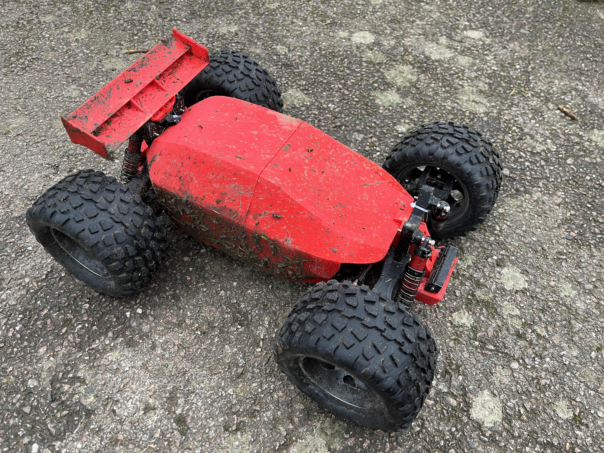

[![CC BY-NC-SA 4.0][cc-by-nc-sa-shield]][cc-by-nc-sa]

# Robak Unkillable Demon Edition

An open-source RC car based on [Robak v2.2](https://github.com/robaki-dev/robak/).

The most resilient RC car on the planet! More driving and less repairing. This car only stops when your battery is empty. If you break this car after flying out of your apartment window I failed.

Select your own hardware with the BOM as your guide. All plastic parts can be 3D printed or bought from [my future webshop?]() (if you want to buy RUDE car parts, ask me in discord for now).

[Printing instructions](docs/printing.md)

[Bill Of Materials](docs/BOM.md)

[Assembly](docs/Assembly.md)

### FAQ: What is this car going to cost me?

Complete kit without plastic parts: Low budget: €200. Premium: €400. The BOM lists all premium parts.