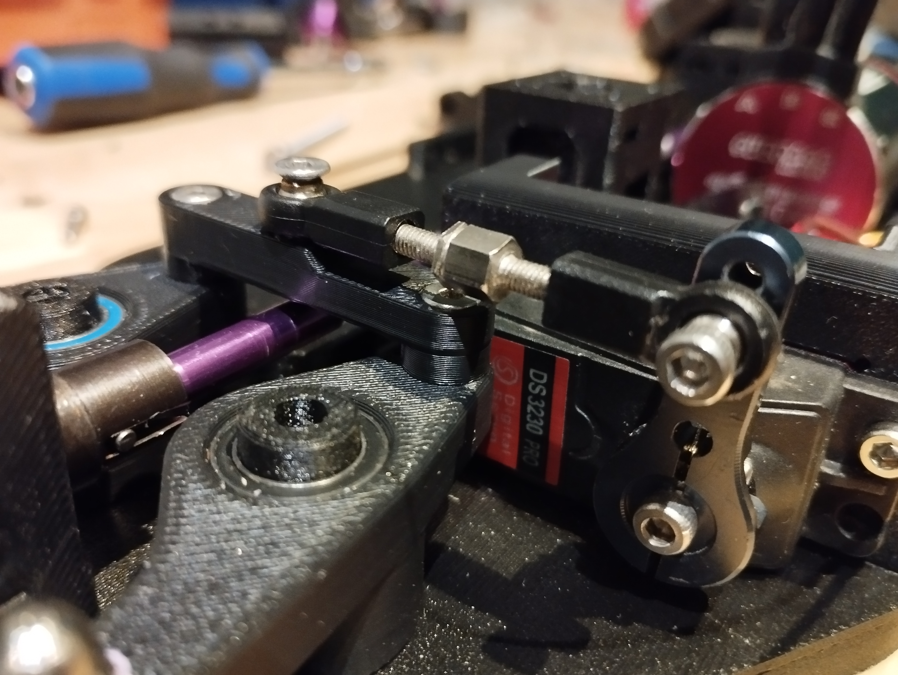
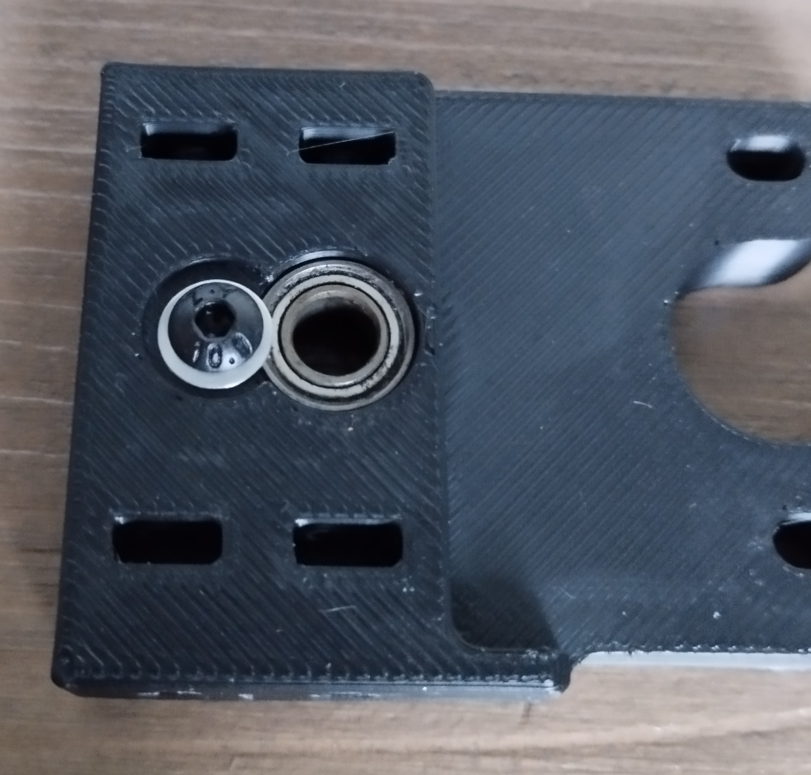

## Assembly

At least loctite all grub screws + bolts going in the HSP steering links. Arms should be able to move freely, don't tighten the M3 bolts that function as joints.

[Info document](https://docs.google.com/presentation/d/1HM81BQhkKSFr_ZRTIKP950ZJcJBYzyWOIWn2UdTEApA/edit?usp=sharing) not everything is relevant for RUDE but pay special attention to the Diffs. I use N2+H2 and also added shims to absolutely remove all side-to-side play.

The link should be installed as follows (you may want to use the top hole on servo horn):

The bearing in motorplate should be locked with a M3 washer + bolt (4mm). This way its possible to drive RUDE with RWD.

For the rest assembly is pretty similar to [this video](https://www.youtube.com/watch?v=374VbFoaV5E).
Note: two M5x40 bolts are used for stiff steering. There are two big square holes in the bottom of the chassis for M5 square nuts.