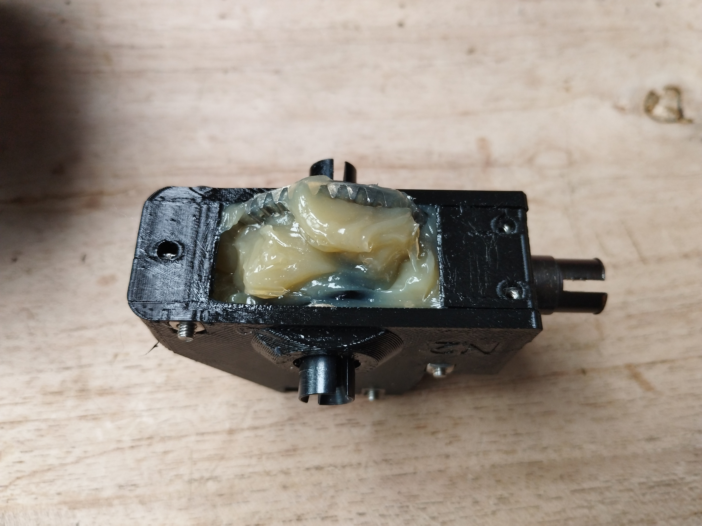

## Assembly

At least loctite all grub screws + bolts going in the HSP steering links. Arms should be able to move freely, don't tighten the M3 bolts that function as joints.

[Info document](https://docs.google.com/presentation/d/1HM81BQhkKSFr_ZRTIKP950ZJcJBYzyWOIWn2UdTEApA/edit?usp=sharing) not everything is relevant for RUDE but pay special attention to the Diffs. I use N2+H2 but make sure to have no side-to-side play.

To make sure your diffs last as long as possible completely fill up the inside with diff oil. Image below shows how it looks from factory (full of air, which is bad):

Also fill up the complete housing with grease, keep rotating until no grease wants to go in anymore, this will make your gears last as long as possible.

The steering link should be installed as follows (you may want to use the top hole on servo horn):

The bearing in motorplate should be locked with a M3 washer + bolt (4mm). This way its possible to drive RUDE with RWD. The main reason for this feature is to protect your differential from damage when the middle axis escapes.

Tires need to be glued to the rims, this needs to be waterproof so there is no water/dirt going inside the wheels, making your car harder to control. Power glue may suffice for plastic rims. ZAP-RT for metal.

For the rest assembly is pretty similar to [this video](https://www.youtube.com/watch?v=374VbFoaV5E).
Note: two M5x40 bolts are used for stiff steering. There are two big square holes in the bottom of the chassis for M5 square nuts.